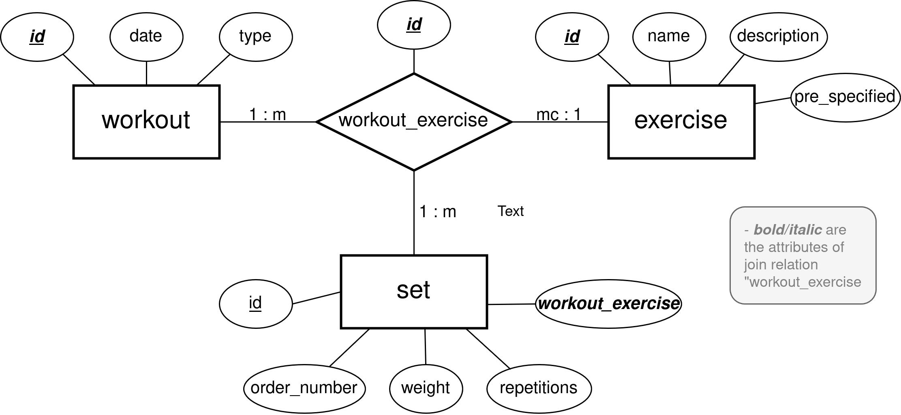

# TrainingsTracker
RestAPI using Spring Boot to track Trainings Data. Automatically spins up a PostgresSQL
Database using Docker as defined in **postgres_docker**. Handles Exceptions meaningful HTTP 
Responses.

## Endpoints

### `/api/exercise`
Endpoint to interact with the Exercises of DB (Examples in: **api/exercise.http** )
- **GET:** Get Exercise by Name (`/name`) **/** Get all Exercises
- **POST:** Create Exercise with DTO described by **src/main/.../ExerciseRequest.java**
- **PUT:** Update Exercise with DTO described by **src/main/ExerciseRequest.java** (`/name`)
- **DELETE:** Delete Exercise by Name (`/name`)

### `/api/workout`
Endpoint to interact with the Workouts of DB (Examples in: **api/workout.http** )
- **GET:** Get Workout by ID (`/id`) **/** Get all Workouts, filter by name or type as Request Parameters 
- **POST:** Create Workout with DTO described by **src/main/.../WorkoutRequest.java**
- **PUT:** Update Workout with DTO described by **src/main/WorkoutRequest.java** (`/name`)
- **DELETE:** Delete Workout by ID (`/id`)

### `/api/training`
Endpoint to interact with the Trainings of DB (Examples in: **api/training.http** )
- **GET:** Get Training by ID (`/id`) **/** Get all Trainings, filter by name or type as Request Parameters
- **POST:** Create Training with DTO described by **src/main/.../TrainingRequest.java**
- **PUT:** Not Implemented
- **DELETE:** Delete Training by ID (`/id`)

## Database Architecture
Database Schemas, Architectures and Constraints are defined by **postgres_docker/schema_init.sql**

## Improvements
- Add Inheritance Hierarchy for Controller and Repository
- Remove Redundancy of JDBC queries
- Add Service Layer for Trainings
- Add Put Method for TrainingsAPI
